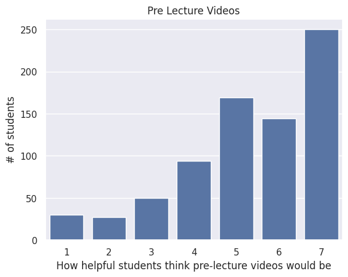
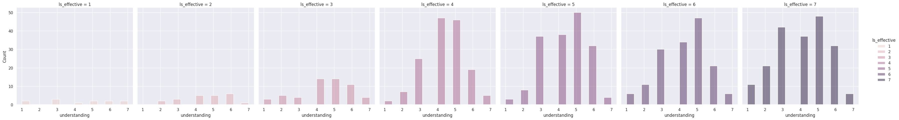

---
# Do not edit the text between these lines!
layout: default
---

# Data Analysis for Increased Video Tutorials

### Topic:

The course should include more video tutorials to help COMP110 students reinforce concepts taught in lecture.

### Idea Value:

This idea is valuable because if video tutorials are effective, students are able to learn content covered in class anywhere, anytime, at their own convenience. This idea has the potential to be beneficial for all COMP110 students. Even a simple change such as recording lectures and uploading them to the course website can improve the accessibility of lesson to students who may have to miss class, or are unable to keep up with lecture. It will also benefit students who struggle to understand notes from reading the posted slides by having a video to guide them through the material.

<!-- This is a comment. Below, you'll see code for inserting an image. To make this image appear, update <custom-path>. To add an image, save it inside the imgs folder of this repository. -->

## Figure 1

Many students find that pre lecture videos would be helpful.

## Figure 2

Students who find the class to have a rapid pace, also responded that they would like to have pre-lecture videos. This relationship implies that students who find the class to be moving quickly, are likely to watch the pre-lecture videos to enhance their understanding.

## Figure 3

Students who found the lesson videos to be more effective generally also had higher levels of understanding as indicated by relatively a greater quantity of responses for understanding with values >= 4.

## Conclusion

Our analysis of the data strongly supports idea of including more video tutorial to reinforce understanding of concepts for COMP110 students.

The first graph shows that a majority of students believe pre-lecture videos would be beneficial to their learning in the course. The second graph analyzed the relationshiop between stduents' perception of class pace and degree of agreement of having pre-lecture videos. It showed that students who find the class to have a rapid pace were also likely to respond favorably for pre-lecture videos. This supports the idea of increasing video tutorials, as students would be able to review videos at their own pace. Lastly, the third graph examines overall student understanding and its correlation with how effective students found lesson videos. Students who found lesson videos to be effective, generally had higher levels of understanding, supporting the effectiveness of video tutorials as a viable method to improve student learning and understanding.

With this analysis, we recommend that pre-lecture videos that preview material in lectures, as well as additional tutrials on topics such as coding examples, will help student learning and produce positive learning outcomes. One potential cost of this strategy would be the time commitment required of instructors and/or peer tutors who would be responsible for making and uploading the video tutorials.

### References

The data for this analysis was sourced from survey data from enrolled COMP110 students.

[izzi.csv](./survey_izzi.csv)

[alyssa.csv](./survey_alyssa.csv)